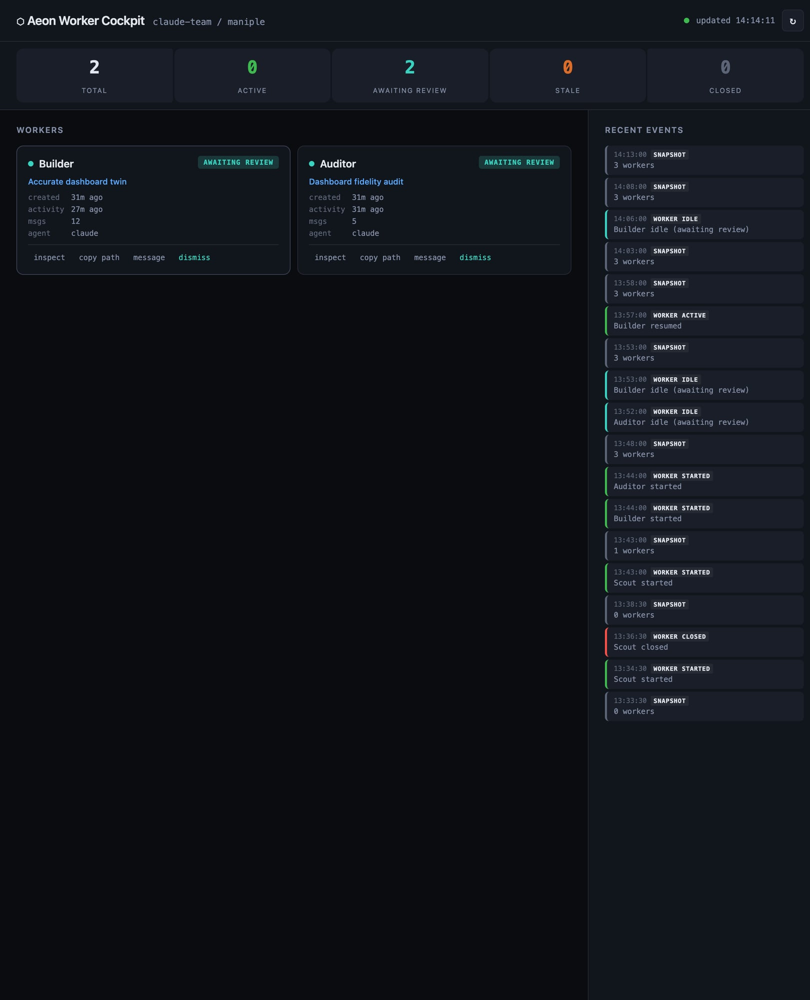

# Aeon Worker Cockpit

Visual mission-control dashboard for `claude-team` / `maniple` workers in an OpenClaw-based workflow.

## Quickstart

```bash
git clone git@github.com:Some1Elsewhere/aeon-worker-cockpit.git
cd aeon-worker-cockpit
cp .env.example .env   # optional
./run.sh
```

Then open:

- <http://localhost:7700>

This app exists to solve one annoying problem: spawned workers are often **doing real work invisibly**. Worker Cockpit gives you a local visual layer that shows what is running, what is idle, what is awaiting review, what looks stale, and what just happened.

## Screenshot



## What it does

- lists current `claude-team` / `maniple` workers
- classifies workers into:
  - **active**
  - **awaiting review**
  - **stale**
  - **closed**
- shows worker metadata:
  - name
  - badge/task
  - created time
  - last activity
  - message count
  - agent type
  - worktree/project path
- shows a recent event stream from the worker event log
- lets you:
  - inspect a worker
  - copy worktree paths
  - send a message to a worker
  - dismiss / close workers
- optionally checks whether a likely Obsidian session note exists

## Stack

- **Node.js only**
- zero runtime dependencies
- plain HTML/CSS/JS frontend
- local API server that shells out to `mcporter`

No database. No cloud deploy. No auth layer. Just local infrastructure talking to your local worker system.

---

# Quick Start

## 1. Clone or copy the repo

```bash
git clone <your-repo-url> aeon-worker-cockpit
cd aeon-worker-cockpit
```

If you are using the copy that was created inside an OpenClaw workspace, just `cd` into it.

## 2. Make sure Node is available

```bash
node -v
```

Node 18+ is a safe default.

## 3. Make sure `mcporter` is installed

```bash
mcporter --help
```

If this fails, install/configure `mcporter` first.

## 4. Start the app

```bash
node server.js
```

Then open:

- <http://localhost:7700>

---

# Clean Install / Full Setup Guide

This section is for a machine that does **not** already have the same OpenClaw + claude-team setup.

## Prerequisites

You need:

- macOS or another machine where your worker backend can run
- Node.js
- OpenClaw installed and working
- Claude Code CLI installed and logged in
- `mcporter` installed
- a running worker backend exposed through `mcporter`

For the exact setup this cockpit was built against, the worker backend is:

- `claude-team` skill
- backed by `maniple-mcp`
- exposed as `claude-team-http`
- reachable at `http://127.0.0.1:8766/mcp`

## A. Install / verify Claude Code

Check:

```bash
claude --help
```

If Claude is installed but not authenticated, run:

```bash
claude /login
```

## B. Install / verify mcporter

Check:

```bash
mcporter --help
```

If it is not installed yet, install/configure it in the way your OpenClaw environment expects.

## C. Set up a worker backend

The cockpit does **not** spawn workers by itself. It visualizes an existing worker system.

The easiest compatible backend is the local `claude-team` / `maniple` HTTP service.

### Example backend command

This is the service model used in the current setup:

```bash
uvx --from maniple-mcp@latest maniple --http
```

That exposes an MCP HTTP endpoint, typically:

- `http://127.0.0.1:8766/mcp`

## D. Connect mcporter to the worker backend

Create or edit:

- `~/.mcporter/mcporter.json`

Example:

```json
{
  "mcpServers": {
    "claude-team-http": {
      "transport": "streamable-http",
      "url": "http://127.0.0.1:8766/mcp",
      "lifecycle": "keep-alive"
    }
  }
}
```

## E. Verify the backend connection

Run:

```bash
mcporter list claude-team-http --schema
```

You should see worker tools like:

- `list_workers`
- `examine_worker`
- `worker_events`
- `message_workers`
- `close_workers`

If that works, the cockpit has what it needs.

## F. Start Worker Cockpit

```bash
node server.js
```

Open:

- <http://localhost:7700>

---

# Connecting it to an existing OpenClaw install

## What Worker Cockpit expects

Worker Cockpit is intentionally dumb/simple. It expects:

1. OpenClaw environment already exists
2. `mcporter` can reach a worker MCP server
3. that worker MCP server exposes compatible tools

The current server implementation is built around the following MCP calls:

- `claude-team-http.list_workers`
- `claude-team-http.examine_worker`
- `claude-team-http.worker_events`
- `claude-team-http.close_workers`
- `claude-team-http.message_workers`

## Important note about tool names

If your MCP server uses different tool names than the current `claude-team-http` profile, update `server.js` accordingly.

The app is intentionally small so this kind of adaptation is easy.

## Current assumptions in `server.js`

- the MCP server name is `claude-team-http`
- `mcporter` is available in PATH
- worker events are accessible through `worker_events`
- worker inspection is accessible through `examine_worker`

If your server name differs, replace references like:

```js
mcporter call claude-team-http.list_workers
```

with your own MCP profile name.

---

# Configuration

## Configuration

You can either export environment variables directly or create a local `.env` file from `.env.example` and start the app with `./run.sh`.

## Environment variables

| Env var | Default | Description |
|---------|---------|-------------|
| `PORT` | `7700` | Local HTTP port for the cockpit |
| `OBSIDIAN_VAULT` | `~/obsidian-vault` | Base path used for Obsidian note lookup |

## Example

```bash
PORT=7710 OBSIDIAN_VAULT="$HOME/Documents/Obsidian Vault/Aeon" node server.js
```

---

# Obsidian integration

The cockpit can check for likely session-note locations for a worker.

Current lookup behavior is intentionally simple and file-based.
It tries patterns like:

- `<vault>/<YYYY-MM-DD>.md`
- `<vault>/workers/<WorkerName>.md`
- `<vault>/sessions/<YYYY-MM-DD>-<WorkerName>.md`
- `<vault>/logs/<YYYY-MM-DD>.md`

If your Obsidian structure differs, adjust the lookup logic in `server.js`.

---

# API

## GET `/api/workers`
Returns current worker list.

## GET `/api/examine?id=<sessionId>`
Returns richer detail for one worker.

## GET `/api/events?since=<iso>`
Returns recent worker events.

## GET `/api/obsidian?name=<workerName>`
Returns whether a matching Obsidian note was found.

## POST `/api/action/message`
Body:

```json
{
  "session_id": "abc123",
  "message": "Please continue with the floorplan alignment pass."
}
```

## POST `/api/action/close`
Body:

```json
{
  "session_id": "abc123"
}
```

---

# Recommended OpenClaw-side setup

If you want a setup close to the one this app was tested against, the stack looks like this:

1. **OpenClaw** for orchestration and local tooling
2. **Claude Code** as the worker engine
3. **claude-team / maniple** for visible worker spawning
4. **mcporter** for MCP connectivity
5. **Aeon Worker Cockpit** for visual progress and control
6. **Obsidian** for worker/session logging

That gives you:

- real visible worker processes
- worktree-based isolation
- a dashboard showing live state
- durable documentation for worker runs

---

# Troubleshooting

## The page loads but shows connection errors

Check:

```bash
mcporter list claude-team-http --schema
```

If that fails, your MCP server is not reachable.

## No workers appear

Check:

```bash
mcporter call claude-team-http.list_workers
```

If the result is empty, the cockpit is fine — you just do not currently have managed workers.

## Message / close actions fail

Check whether your worker MCP server exposes:

- `message_workers`
- `close_workers`

If your backend differs, update `server.js` tool mapping.

## Obsidian notes are not detected

Set the vault path explicitly:

```bash
OBSIDIAN_VAULT="$HOME/Documents/Obsidian Vault/Aeon/Agents/Workers" node server.js
```

Or adapt the path matching logic in `server.js`.

## Port 7700 is busy

Run on another port:

```bash
PORT=7710 node server.js
```

---

# Run helper

A small launcher script is included:

```bash
./run.sh
```

It will load `.env` automatically if present, then start the Node server.

---

# Development

Run locally:

```bash
node server.js
```

There is no build step.

Files of interest:

- `server.js` — local API layer and static server
- `public/index.html` — shell layout
- `public/style.css` — visual system
- `public/app.js` — polling, rendering, state logic, actions

---

# Notes

This project is intentionally small and local-first.
The point is not architectural purity; the point is to know, visually and immediately, whether your spawned workers are actually doing something.
